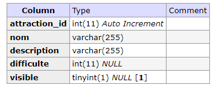
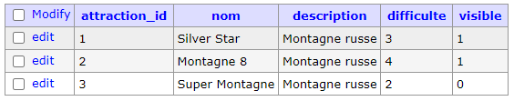
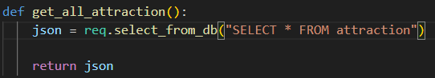
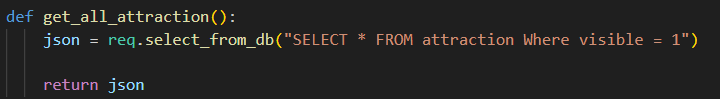

# Maintenance Applicative | Parc d'attraction

## 1er Partie, Test de Fonctionnement

> le projet est dans un container docker ce qui nous permet de facilement pouvoir le build, peut importe l'environnemenet et ducoup nous évite de gerer la maintenance systeme. Néanmoins pour avoir une meilleur vision globale du projet j'ai rajouter au docker une image adminer, qui est un outils qui me permet de facilement visualisé et interragir avec la base de donnée

### Visible / pas Visible

> On remarque un premier problème, l'état des attracions n'est pas entiérement fonctionnelle il manque une fonctionnalité qui à était soit mal implémenté ou pas implémenté qui visent a faire en sorte que les éléments ne soit pas visible

- je commence par verifier si le model de base de donnée de chaque attraction est complet



- il l'est donc le problème viens d'ailleurs, le problème le plus courant serait qu'il serait mal enregistré dans la base de donnée, alors dans un premier temps j'essaie de voir si c'est le cas, je créé alors une nouvelle attraction et j'active l'option, puis je fais grace a adminer un select dans la base de donnée 



- Mais je remarque que l'enregistrement ce fait correctement, alors le problème est necessairement lié a l'affichage, je vais donc voir le code qui affiche l'acceuil pour trouver la fonction qui renvoie toutes les attractions, donc dans l'api.



- Le problème est rapidement visible et ce trouve dans la requête sql, qui ne prend pas en compte si l'attraction doit être visible ou non, donc il me suffit de corriger la requete, et c'est donc enfin fonctionnelle



- mais ça créé un nouveau problème, les attractions non visible ne s'affiche pas dans la liste admins, je vais donc créé une nouvelle méthode dans le controller qui me permet d'afficher vraiment toutes les attractions, requête que je n'utiliserais que sur le panel admin, je créé donc une nouvelle route et renomme l'ancienne


```py
def get_all_attractionValide():
    json = req.select_from_db("SELECT * FROM attraction Where visible = 1")
    return json
  
def get_all_attraction():
    json = req.select_from_db("SELECT * FROM attraction")
    return json
```

```py
@app.get('/attraction')
def getAllAttractionValide():
    result = attraction.get_all_attractionValide()
    return result, 200
  
@app.get('/attractions')
def getAllAttraction():
    checkToken = user.check_token(request)
    if (checkToken != True):
        return checkToken
      
    result = attraction.get_all_attraction()
    return result, 200
```
- la différence ce fait principalement sur le fait que la fonction du panel administrateur vérifie l'intégrité du token d'authentification pour éviter que tout le monde puissent y avoir accès, le problème est désorrmais réglé et respecte les règles de sécurité mis en place.

## 2nd Partie, Ajout de solutions

### Mise en place des critiques

> la première chose a faire c'est de mettre en place une table dans la base de donnée pour acceuillir les différente critique, on l'ajoute également au script de création du docker pour simplifier le travail futur.

```sql
DROP TABLE IF EXISTS critique;

CREATE TABLE critique (
    critique_id int auto_increment,
    primary key(critique_id),
    attraction_id int,
    foreign key(attraction_id) REFERENCES attraction(attraction_id),
    text nvarchar(3000) not null,
    name varchar(255) not null,
    surname varchar(255) not null,
    score int not null
);
```

> Je créé aussi une commande SQL pour avoir une valeur de test dès le début

```sql
INSERT INTO critique(text, name, surname, score, attraction_id) 
VALUES ('Super Attraction je recommande','Super', 'Fan', 4,  
        (Select min(attraction_id) as attraction_id from attraction) 
        );
```

> il faut désormais que je fasse l'api pour necessaire a la creation de critique


#### attraction/$id/critique

> Permet d'obtenir toutes les critique d'une seul attraction

> il faut donc dans un premier temps créé le controller, je créé donc le fichier python dans controller/ avec la fonction get_all_critique qui renvoie la liste de toutes les critique d'une même application

```py
def get_all_critique(attraction_id):
    if (not attraction_id):
        return False

    json = req.select_from_db("SELECT * FROM critique WHERE attraction_id = ?", (attraction_id,))

    if len(json) > 0:
        return json[0]
    else:
        return []
```

> Ensuite dans le fichier app.py ou sont affiché toutes les routes, je rajoute la bonne route, ici /attraction/<int:index>/critique, qui ne fait que renvoyé le resultat du controller

```py
@app.get('/attraction/<int:index>/critique')
def get_critique(index):
    result = critique.get_all_critique(index)
    return result, 200
```